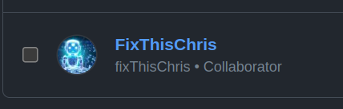

import { Card, CardGrid, Icon } from '@astrojs/starlight/components';

## Quick-Start

<CardGrid stagger>
	<Card title="Add Chris as Collaborator" icon="github">
		Go to <b class="ml-2"> Setting > Collaborator > Add People</b>
    {/*  */}
     
	</Card>
	<Card title="Create or Go to any issue" icon="add-document">
    Comment `@fixThisChris` and wait for fixThisChris to do the magic 🪄
	</Card>
	{/* <Card title="Usage" icon="setting">
		Edit your `sidebar` and other config in `astro.config.mjs`.
	</Card> */}
	{/* <Card title="Read the docs" icon="open-book">
		Learn more in [fixThisChris Docs](/guides/example)
	</Card> */}
</CardGrid>
